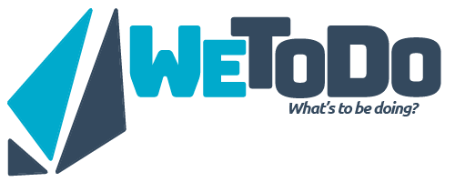

----

WeToDo is a easy-to-use to-do list and notepad, made with both simplicity and power in mind. Keep track of your goals with a few simple taps.

Moreover, with collaborative editing, you can decide who is bringing what to a party, make a grocery list for your family, keep track of pieces of a group project, and more!

More information is available at the [Vevox Workshop](http://vevox.io/p/wetodo). Please submit any comments, questions, or issues through the [GitHub Issue Tracker](https://github.com/VevoxDigital/WeToDo/issues).

----

Client available under [GPL v3.0](/LICENSE). Copyright &copy; [Matthew Struble](https://github.com/CynicalBusiness).

*To My Warrior, Half the World Away*
